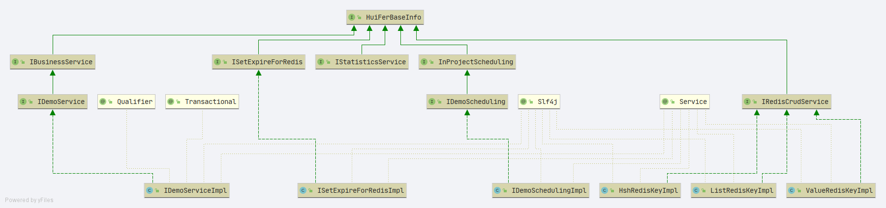

# 基本应用项目

## 类图

### 接口说明
- `com.huifer.baseweb.base.HuiFerBaseInfo` 基本信息,所有接口**必须重写**`info`方法
- `com.huifer.baseweb.service.IStatisticsService` 统计服务标记接口,所有和统计相关的操作**必须继承接口**
- `com.huifer.baseweb.service.IBusinessService` 业务接口标记,所有业务相关(增加\修改\删除\查询)操作**必须继承接口**
- `com.huifer.baseweb.redis.IRedisCrudService` redis操作标记接口,**必须继承接口**
- `com.huifer.baseweb.redis.expire.ISetExpireForRedis` redis 过期key 相关操作**必须继承接口**
- `com.huifer.baseweb.scheduling.InProjectScheduling`定时任务相关 **必须继承接口**

### 常量
- 基准类: `com.huifer.baseweb.constants.BaseConstants`
- 内部可持有多个类,分别表示不同的常量类型,如时间格式化:DataFormat
- 注意 redis key 必须存放在这里. 使用者需要在使用类中再定义一个常量接收`public static final String xxx`
